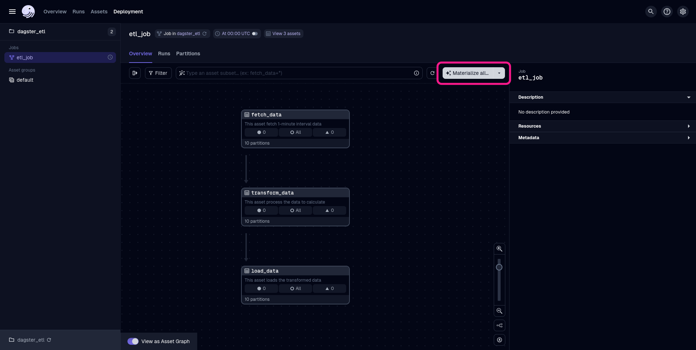
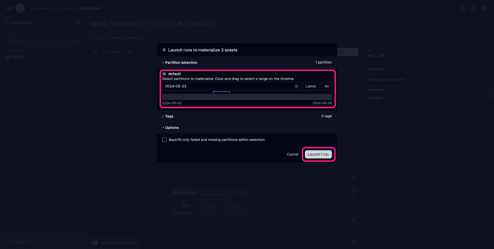
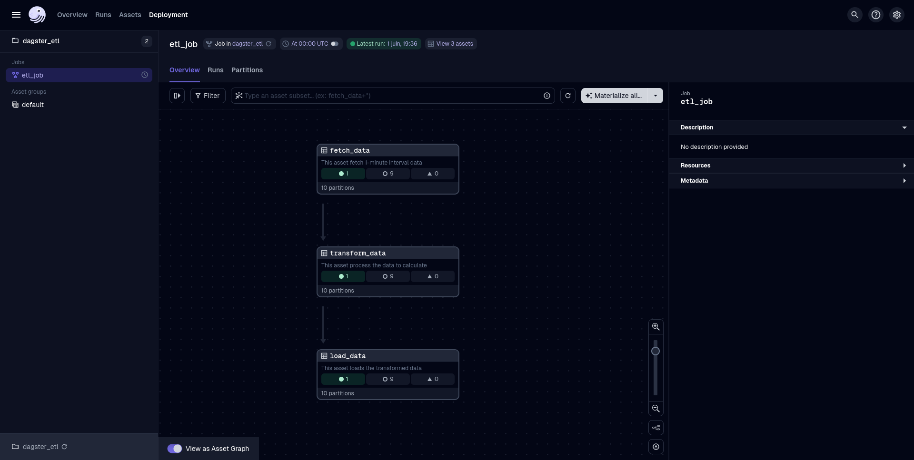

# Delfos Data Eng Test

This project consists of a simple ETL pipeline between two databases. I opted for creating two PostgreSQL servers to represent the streaming of data. The server containing the `Fonte` database can be accessed through port `5432` and the one containing the `Alvo` database through port `5433`.

In order to isolate the source database, a FastAPI-based API was created. At its initialization, it randomly generates data for the database.

- The chosen initial date is `2024-05-20T00:00:00`, and it can be modified `fonteapi/crud.py` on `line 15`.

The ETL pipeline was implemented in two different ways: one uses Dagster for its orchestration and the other don't.

## Prerequisites

- Docker
- Docker Compose
- Python 3.9 or higher

## Setup Instructions

1. **Clone the repository:**

    ```bash
    git clone https://github.com/hsimplicio/delfos-dev-test.git
    cd delfos-dev-test
    ```

2. **Create and activate a python vitual environment**

    ```bash
    python3 -m venv venv
    source venv/bin/activate
    ```

3. **Install the requirements**

    ```bash
    pip install -r requirements.txt
    ```

4. **Build and start the Docker containers:**

    ```bash
    docker compose up --build -d
    ```

    This will set up two PostgreSQL databases and start the FastAPI server.

## Testing the Project

To test the project, follow these steps:

1. **Ensure the Docker containers are running:**

    ```bash
    docker compose up -d
    ```

2. **Run the ETL pipeline:**

    - **Using the `etl.py` script:** 

        To fetch and process data for a specific date, run the following command:

        ```bash
        python etl.py YYYY-MM-DD
        ```

        Replace `YYYY-MM-DD` with the desired date. Note: range between `2024-05-20` and `2024-05-29`.

        This command will:
        - Fetch data columns `power` and `wind_speed` from the API for the specified date.
        - Process the data to calculate mean, min, max, and std for each 10-minute interval.
        - Load the processed data into the second PostgreSQL database.

        To specify which columns to fetch, use the `--columns` parameter.

        ```bash
        python etl.py YYYY-MM-DD --columns power wind_speed ambient_temperature
        ```
    
    - **Using Dagster:**

        First, start Dagster in developer mode:

        ```
        dagster dev
        ```

        To execute the pipeline you can use Dagster UI at port `http://localhost:3000`:

        First, click on the button *Materialize all...*:

        

        Then, select the date (or date range) for which to run the job and click on  the button *Launch run*:

        

        Once finished, the assets should look like the following image.

        


4. **Verify the data:**

    You can connect to the PostgreSQL databases to verify the data using any PostgreSQL client. 

## Additional Notes

### API

The API is available at `http://localhost:8000`:
- The endpoint to fetch data is `/data`. The accepted query parameters are `start_timestamp`, `end_timestamp`, and `columns`.
- You can check the API documentation at `/docs`.

### Performance using Dagster `Resource`

The `load_data` asset started to present a slow performance after I implemented the `Resource` to manage the connection with the database. I couldn't find the reason for it, but the performance improvement can be noticed uncommenting the right lines in the asset.

### Data persistance

The project uses anonymous volumes for PostgreSQL data, so the data will not persist across `docker compose down` and `docker compose up` commands, and the pipeline can be tested with new data.

## Cleanup

To stop and remove the Docker containers, run:

```bash
docker compose down
```
